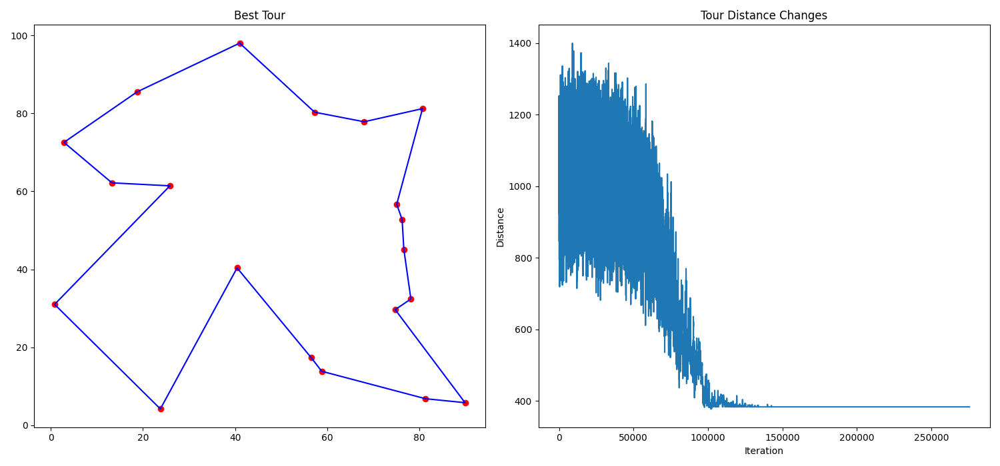

# Simulated Annealing for Traveling Salesman Problem

This repository contains an implementation of the Simulated Annealing (SA) algorithm to solve the Traveling Salesman Problem (TSP). The Simulated Annealing algorithm is a probabilistic technique used to find an approximate solution to an optimization problem. It is inspired by the process of annealing in metallurgy.

## Overview

Simulated Annealing is an optimization technique that attempts to find the global minimum (or maximum) of a function by iteratively exploring the solution space. The algorithm starts with an initial solution and a high "temperature" that allows for large moves in the solution space. As the temperature decreases, the algorithm makes smaller and more refined moves, ultimately converging to an optimal or near-optimal solution.

## Key Components of Simulated Annealing

- **Objective Function**: The function to be minimized or maximized. In this case, it is the total distance of a TSP tour.
- **Temperature**: Controls the exploration of the solution space. Higher temperatures allow more significant changes, while lower temperatures focus on fine-tuning.
- **Cooling Schedule**: Determines how the temperature decreases over time. It can be geometric, logarithmic, or another custom schedule.
- **Transition Probability**: Defines whether a new solution is accepted. At higher temperatures, even worse solutions can be accepted to escape local minima.

## Implementation Details

The code provided implements the Simulated Annealing algorithm to solve a TSP with randomly generated cities. The main functions include:

- **`generate_cities(n)`**: Generates `n` random coordinates, representing cities.
- **`distance(city1, city2)`**: Calculates the Euclidean distance between two cities.
- **`total_distance(tour, cities)`**: Computes the total distance of a given tour.
- **`swap_cities(tour)`**: Selects two cities in the tour and swaps them to generate a neighboring solution.
- **`simulated_annealing(cities, initial_temperature, cooling_rate, stopping_temperature)`**: Implements the Simulated Annealing algorithm.

## Example Parameters

- **Number of Cities**: 18
- **Initial Temperature**: 1000
- **Cooling Rate**: 0.995
- **Stopping Temperature**: 0.001

## How to Run the Code

1. Ensure you have Python installed on your system.
2. Install the required libraries:
    ```bash
    pip install -r requirements.txt
    ```
3. Run the script:
    ```bash
    python app.py
    ```

## Visualization

The script generates two plots:

- **Best Tour**: Shows the shortest path found between the cities. The cities are displayed as red dots, and the best tour is represented by a blue line connecting the cities.
- **Tour Distance Change**: Displays how the tour distance evolves over iterations.

## Example Results Output

Best Distance: 365.7
Here is an example of the results from the simulation:




The left plot displays the cities as red dots and the best tour as a blue line connecting the cities. The right plot shows how the total distance of the tour changes over iterations.

## Advantages and Disadvantages of Simulated Annealing

**Advantages:**

- Ability to escape local minima and find the global minimum.
- Simple to implement and applicable to a wide range of problems.

**Disadvantages:**

- Can be slow to converge, especially for large problems.
- The choice of parameters (initial temperature, cooling schedule) is crucial and may require experimental tuning.

## License

This project is licensed under the MIT License. See the `LICENSE` file for details.

## Contact

For any questions, feel free to reach out at [Dilaver's GitHub profile](https://github.com/enesdilaversahin) or via [email](mailto:enesdilaversahin@gmail.com).

